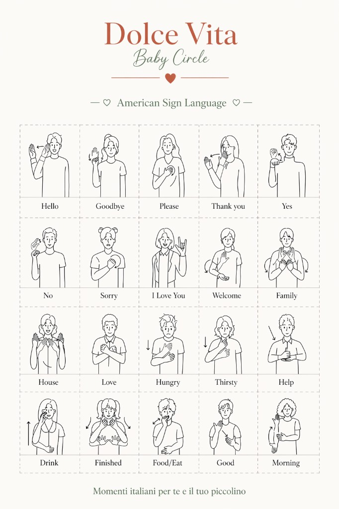

# Brand logo & lockup spec — Dolce Vita

> **Status:** captured — implementation deferred to **pre-launch polish (M6)**.
> **Source:** founder, Apr 25 2026 (poster reference + ChatGPT design spec).
> **Tracked:** GitHub issue (TBD when filed against the M6 milestone).

The brand mark currently rendered in `dolcevitact-web` (in `SiteNav.svelte`,
`SiteFooter.svelte`, and the SvelteKit hero fallback in
`src/routes/(app)/+page.svelte`) is a placeholder. The canonical mark is the
"Dolce Vita / Baby Circle" stacked lockup shown in
[`assets/brand-logo-reference.png`](./assets/brand-logo-reference.png) and
specified below.

This file is the source of truth for the visual treatment until it is fully
implemented; once implemented, leave this file in place as documentation.

---

## Reference



The reference is a poster — only the **header lockup** (title block + thin
divider + heart) is the brand mark. The poster body and footer are unrelated
to the brand spec and provided only for visual context.

---

## Lockup anatomy

```
┌──────────────────────────┐
│      Dolce Vita          │  serif, terracotta — primary mark
│       Baby Circle        │  script, muted green — sub-mark / offering
│        ─── ♥ ───         │  thin gold/terracotta divider with centered heart
└──────────────────────────┘
```

- **Order is locked:** title → subtitle → divider+heart. Never reorder, never
  break the stack into a horizontal row.
- **Centered** on its own axis. Use full-width centering in nav/footer
  contexts; left-align only with explicit override.

---

## Verbatim design spec (founder, via ChatGPT brand-design chat)

The following spec is normative for the lockup. When implementing in code,
treat the values as **proportions on a 1024×1536 px reference canvas**, then
scale uniformly to the rendered context (nav: smaller; hero: full).

```
DOLCE VITA — HEADER & FOOTER RULES

🔒 GLOBAL
  Canvas:   1024 × 1536 px (portrait)
  Layout order (LOCKED):
    Header
    Content
    Footer
  ❌ Do not scale, rebalance, or reinterpret layout
  ❌ Do not change proportions
  If conflict → remove decoration only

🟢 HEADER (LOCKED)
  Structure (fixed)
    Dolce Vita
    Baby Circle
    — thin line + small heart —
    Centered

  Size (STRICT RATIO)
    Dolce Vita = 1.0x
    Baby Circle = 0.5x
    Baseline:
      Dolce Vita: 52px
      Baby Circle: 26px

  HARD LIMITS
    Dolce Vita ≤ 7% of canvas height (~108px max, but DO NOT exceed 52px baseline)
    Full header block ≤ 12% of canvas height (~184px)
    ❌ Never increase size beyond baseline
    ❌ If header feels large → reduce BOTH proportionally

  Style
    Dolce Vita: serif, terracotta
    Baby Circle: script, muted green

  Spacing (LOCKED SYSTEM)
    Define:
      👉 U = 16px
    Top margin:           2.5U  (40px)
    Title → subtitle:     0.5U  (8px)
    Subtitle → divider:   0.75U (12px)
    Divider → content:    2U    (32px)
```

### Implementation translation

When porting the spec into the SvelteKit nav / footer / hero, treat it as
ratios anchored to the "Dolce Vita" baseline:

| Token            | Reference (1024×1536) | Ratio to title baseline | Code intent                                                |
| ---------------- | --------------------- | ----------------------- | ---------------------------------------------------------- |
| Dolce Vita size  | 52 px                 | 1.0×                    | Hero: full size · Nav: ~24–28 px · Footer: ~32–40 px       |
| Baby Circle size | 26 px                 | 0.5×                    | Always exactly half the rendered title size                |
| Title→subtitle   | 8 px                  | 0.154×                  | Use `clamp()` keyed off `--dv-lockup-size`                 |
| Subtitle→divider | 12 px                 | 0.231×                  | Same                                                       |
| Divider→content  | 32 px                 | 0.615×                  | Wrapper margin, not the mark itself                        |
| Top margin       | 40 px                 | 0.769×                  | Hero shell only — irrelevant in nav (nav has its own pad)  |

The "1.0× / 0.5× ratio" is the only inviolable rule. Spacing units scale with
the title. Build a CSS custom property (`--dv-lockup-size`) and derive
everything from it so a single value drives nav/footer/hero variants.

---

## Color tokens (mapping spec → existing design system)

The spec uses informal color names; the existing M3 design system already has
the right tokens. Map them as follows in the lockup component:

| Spec color           | Token (`src/lib/styles/tokens.css`) | Notes                                    |
| -------------------- | ----------------------------------- | ---------------------------------------- |
| terracotta (title)   | `--dv-color-terracotta`             | Already used for accents                 |
| muted green (script) | `--dv-color-sage` (verify shade)    | Confirm matches "muted green" in poster  |
| divider line         | `--dv-color-gold` (low-opacity)     | Existing `GoldRule` decorative           |
| heart                | `--dv-color-terracotta`             | Same as title for color anchoring        |

Visual QA pass on the poster against the live tokens may require tuning the
sage shade or introducing a `--dv-color-sage-soft` token — capture in the
implementation PR, not here.

---

## Typography

| Element     | Family (current)      | Notes                                                       |
| ----------- | --------------------- | ----------------------------------------------------------- |
| Dolce Vita  | Cormorant Garamond    | Already loaded via `app.css`. Weight 500 reads closest to poster. |
| Baby Circle | Tangerine             | Already loaded. Weight 700 (the bolder cut) for legibility at small sizes. |
| Heart glyph | inline SVG (preferred) | Avoid emoji `♥` — ships inconsistent across OS. Build a small SVG matching the poster's terracotta heart. |

---

## Where the lockup currently appears in code

Tracked so the implementation PR can find every site:

| File                                                  | Today                                              | Pre-launch action                                   |
| ----------------------------------------------------- | -------------------------------------------------- | --------------------------------------------------- |
| `src/lib/components/navigation/SiteNav.svelte`        | Plain text `siteTitle` prop                        | Replace with `<BrandLockup variant="nav" />`        |
| `src/lib/components/navigation/SiteFooter.svelte`     | Plain text `siteTitle` prop                        | Replace with `<BrandLockup variant="footer" />`    |
| `src/routes/(app)/+page.svelte` (hero fallback)       | Stacked `dv-script "Dolce Vita"` + `dv-h1` headline | Replace with `<BrandLockup variant="hero" />`       |
| `src/lib/components/blocks/HeroBlock.svelte`          | CMS-driven hero                                    | Decide: render `BrandLockup` ABOVE the headline, or only when CMS provides `script_accent` (currently not in schema). |

A new component `src/lib/components/brand/BrandLockup.svelte` (with three
variants — `nav`, `footer`, `hero`) is the proposed implementation surface.
Single source of truth for sizes, spacing, colors, and the heart SVG.

---

## Out of scope here

- Poster body illustrations (sign-language hands) — not part of the brand
  mark, not a web concern.
- "Momenti italiani per te e il tuo piccolino" tagline at the poster footer —
  evaluate separately for nav/footer copy in pre-launch polish.
- Alternative lockups for sub-brand offerings (Cucina, classes) — out of scope
  until those chapters are commissioned (see ADR 0002).

---

## References

- Founder source: ChatGPT design-spec chat, Apr 25 2026
- Poster: [`assets/brand-logo-reference.png`](./assets/brand-logo-reference.png)
- Brand architecture context: [ADR 0002](../adrs/0002-brand-architecture.md)
- Design system tokens: `src/lib/styles/tokens.css`
- Pre-launch polish backlog: M6 Launch milestone
